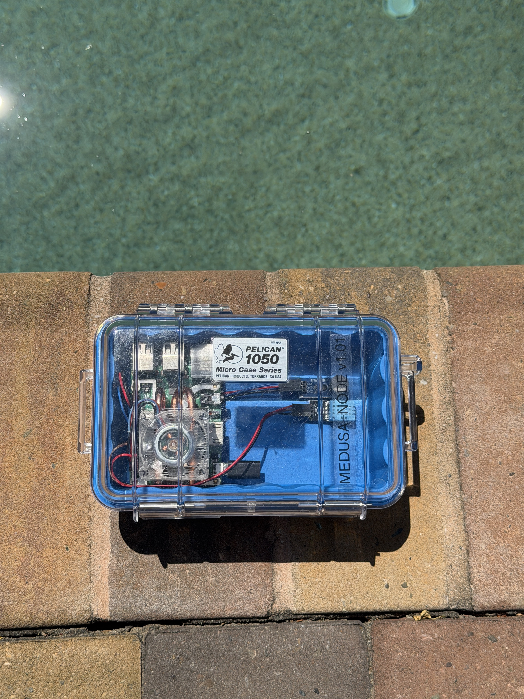
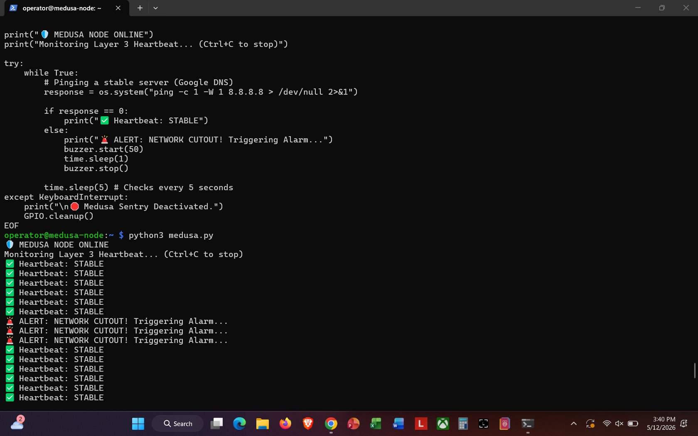

# Medusa Node v1.01: Network Sentinel 🚨

**A ruggedized, Raspberry Pi-powered Layer 3 monitoring unit designed for business continuity.**

## 📖 Project Overview
The Medusa Node bridges the gap between **Layer 3 (Network)** and **Layer 1 (Physical)**. Developed for "The Daily Grind" café, it monitors the network heartbeat and triggers a high-decibel physical alarm the moment a gateway cutout is detected.

## 🛠 Hardware Architecture
* **Chassis:** Pelican 1050 Micro Series (IP67 Rated).
* **Logic:** Python-driven ICMP polling & GPIO-driven alerts.
* **Security:** Hardened SSH-2.0 encrypted administrative tunnel.
* **Thermals:** Active RGB PWM cooling for 24/7 uptime.

---

## 📸 Gallery

### System Status: Active
*The unit in sentinel mode, utilizing a clear-case design for visual status verification.*

### Internal Architecture
*Visual verification of the Raspberry Pi SoC, active cooling array, and the Piezo-acoustic alerting module.*

### Field Testing & Durability
*Environmental stress testing of the IP67-rated chassis for deployment in high-moisture/dust environments.*

### Proof of Concept (The Scream Test)
*Live terminal output demonstrating the transition from a stable heartbeat to an active alarm state during a simulated network failure.*

---

## 📄 Documentation
For a deep dive into the protocol hierarchy analysis, packet captures, and the full business continuity case:

[👉 Download the Technical White Paper (PDF)](./Medusa_Node_v1.01_Technical_Report.pdf)
